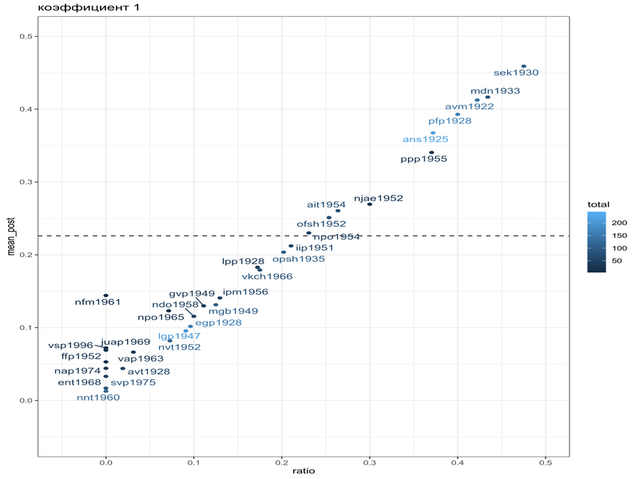

```{r setup, include=FALSE}
knitr::opts_chunk$set(echo = TRUE, message=FALSE, warning = FALSE, fig.width=11, fig.height=8)
library(tidyverse)
theme_set(theme_bw()+theme(text = element_text(size = 20)))
```

Packages:

```{r, eval = FALSE}
library(tidyverse)
library(ggrepel)
library(fitdistrplus)
```


## Data

Empirical Bayes estimation -- is one of the methods where:

* prior knowledge is estimated based on the whole dataset;
* prior knowledge is used for updating individual groups within the dataset.

Let's work with data from [@daniel19]. They analyze the dynamics of dialect loss in a cluster of villages in rural northern Russia based on a corpus of transcribed interviews, the Ustja River Basin Corpus. They analized eleven phonological and morphological variables are analyzed across 33 speakers born between 1922 and 1996. Here we will focuse on one feature: height of *a*: conservative forms are [ꞌpʲetʲero], inovative forms are [ꞌpʲatʲərə].

```{r}
ustja <- read_csv("https://raw.githubusercontent.com/agricolamz/2021.12.13_intro_to_empirical_bayes/master/data/mikhalevskoje_a_e.csv")

ustja %>% 
  mutate(speaker = fct_reorder(speaker, ratio)) %>% 
  ggplot(aes(ratio, speaker))+
  geom_point(aes(size = total))+
  ggrepel::geom_text_repel(aes(label = total))+
  labs(y = "")
```

Speakers are different in terms of number of contexts in their interview  ranging from `r min(ustja$total)` to `r max(ustja$total)`. Do we believe that speaker `lpp1928` with 29 observations is more dialectal then `mgb1949` with 104 observations?

```{r}
ustja %>% 
  filter(ratio != 0,
         ratio != 1) %>% 
  ggplot(aes(ratio))+
  geom_histogram(bins = 15)
```

I will fit beta distribution with maximum likelihood estimation:

```{r}
ustja %>% 
  filter(ratio != 0,
         ratio != 1) %>% 
  pull(ratio) %>% 
  fitdistrplus::fitdist(distr = 'beta', method = 'mle') ->
  beta_est

beta_est
```

The result looks like this:

```{r}
ustja %>% 
  filter(ratio != 0,
         ratio != 1) %>% 
  ggplot(aes(ratio))+
  geom_histogram(bins = 15)+
  stat_function(fun = dbeta, colour = "red", 
                args = list(shape1 = beta_est$estimate[1],
                            shape2 = beta_est$estimate[2]))
```


```{r}
ustja %>% 
  mutate(alpha_prior = beta_est$estimate[1],
         beta_prior = beta_est$estimate[2],
         alpha_post = conservative+alpha_prior,
         beta_post  = innovative+beta_prior,
         mean_post = alpha_post/(alpha_post+beta_post)) %>% 
  ggplot(aes(ratio, mean_post, label = speaker, color = total))+
  geom_hline(yintercept = beta_est$estimate[1]/sum(beta_est$estimate), linetype = 2)+
  geom_point()+
  ggrepel::geom_text_repel()
```

As we can see bayesian update is not so different from simple ratio estimation. In order to see stronger effect of prior we can multiply it by 10 and 40:

```{r}
ustja %>% 
  mutate(alpha_prior = beta_est$estimate[1]*10,
         beta_prior = beta_est$estimate[2]*10,
         alpha_post = conservative+alpha_prior,
         beta_post  = innovative+beta_prior,
         mean_post = alpha_post/(alpha_post+beta_post)) %>% 
  ggplot(aes(ratio, mean_post, label = speaker, color = total))+
  geom_hline(yintercept = beta_est$estimate[1]/sum(beta_est$estimate), linetype = 2)+
  geom_point()+
  ggrepel::geom_text_repel()

ustja %>% 
  mutate(alpha_prior = beta_est$estimate[1]*40,
         beta_prior = beta_est$estimate[2]*40,
         alpha_post = conservative+alpha_prior,
         beta_post  = innovative+beta_prior,
         mean_post = alpha_post/(alpha_post+beta_post)) %>% 
  ggplot(aes(ratio, mean_post, label = speaker, color = total))+
  geom_hline(yintercept = beta_est$estimate[1]/sum(beta_est$estimate), linetype = 2)+
  geom_point()+
  ggrepel::geom_text_repel()
```

And here is the `.gif`:



## References